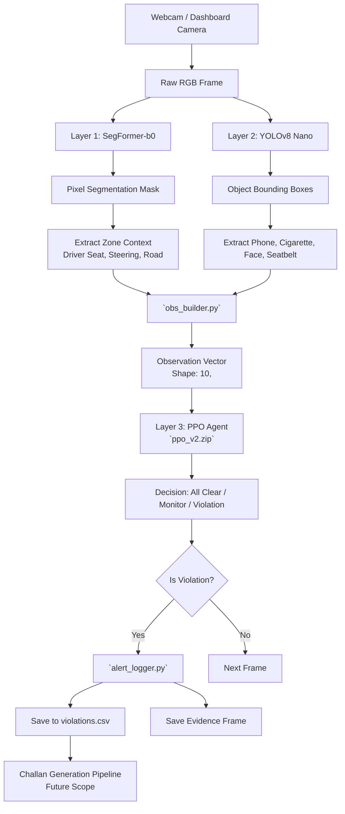

# SmartRoad AI: System Architecture

## Architecture Diagram

## Module Descriptions

1. **`pipeline.py` & Layer 1/2 Loaders:**
   - Handles webcam initiation and passes frames to HuggingFace Transformers (SegFormer) and Ultralytics (YOLOv8) models.
   - Outputs bounding boxes and semantic masks.

2. **`obs_builder.py`:**
   - Takes combined bounding boxes and segmentation masks to build the reinforcement learning environment's observation vector.
   - Computes state durations (e.g., how long the phone has been actively tracked).

3. **`rl_environment.py`:**
   - The Gym-compatible custom environment (`DriverEnv`) wrapping the state space and the reward logic. Provides the boundary between ML computer vision and RL decision making.

4. **Layer 3 Agent (PPO - `train_ppo.py` / `ppo_v2.zip`):**
   - Given a state vector from the environment, output an action evaluating whether a violation has occurred (`0`, `1`, `2`).

5. **`alert_logger.py`:**
   - If action `2` (Violation) is outputted by the RL agent for a continuous timeframe, it captures the current original RGB frame and logs to a localized CSV with severity tracking.

6. **`final_integrate.py`:**
   - The end-to-end event execution loop. Wraps all the layers sequentially per frame and streams to the visual UI dashboard showing all real-time statuses.
